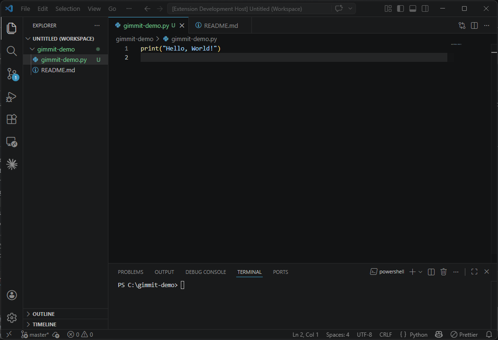

# gimmit

Generate clean, conventional commit messages directly from your changed files — without leaving VS Code.

## Demo

<!-- Replace this GIF with a real demo -->
<!--  -->
🚧 Demo coming soon
> Select files → pick a commit type → copy a ready-to-run git command

## Why gimmit?

Writing conventional commits manually is slow and inconsistent.

gimmit automates it by:
- reading your changed files
- suggesting the correct commit type
- generating a ready-to-use command

> Think of gimmit as a smart layer on top of `git add` + `git commit`.

## Features

- **Live file tracking** — auto-updates from `git status`
- **Smart commit suggestions** — based on file names and paths
- **Clean conventional commits** — properly formatted every time
- **Copy-ready commands** — `git add` + `git commit` in one click
- **Body & footers support** — refs, co-authors, and more
- **Breaking change handling** — automatic `!` + footer formatting
- **Multi-repo support** — works across workspaces
- **None mode** — generate plain commit messages when needed

## Usage

1. Open a git repository in VS Code
2. Make some changes to files
3. Open the **gimmit** panel (activity bar)
4. Select which files to include in the commit
5. Choose a commit type — gimmit suggests one automatically
6. Adjust the message if needed
7. Optionally add a body, footers, or mark as a breaking change
8. Click **Copy** and paste the command into your terminal

Basic example:

```
git add src/auth.ts src/api/users.ts
git commit -m "feat(src): add JWT refresh token logic"
```

Advanced example (with body + footers):

```
git add src/auth.ts
git commit -m "feat(src)!: update auth endpoint" -m "- src/auth.ts [Modified, feat]" -m "BREAKING CHANGE: JWT tokens are now required
Refs: #42
Co-authored-by: Jane <jane@example.com>"
```

## Commit Types

| Type       | Description                          | Auto-detected from                                        |
|------------|--------------------------------------|-----------------------------------------------------------|
| `feat`     | New feature                          | Everything else                                           |
| `fix`      | Bug fix                              | `bug`, `fix`, `patch`, `hotfix`, `error`, `crash`        |
| `docs`     | Documentation                        | `README`, `.md`, `docs/`, `changelog`, `LICENSE`, `.txt` |
| `chore`    | Config or tooling                    | `.json`, `.yaml`, `.yml`, `.env`, `config`, `Dockerfile`   |
| `style`    | Formatting, CSS                      | `.css`, `.scss`, `.less`, `.styled.`, `theme`            |
| `test`     | Tests                                | `.test.`, `.spec.`, `__tests__/`, `test/`                |
| `refactor` | Code restructure, no behaviour change| —                                                         |
| `perf`     | Performance improvement              | —                                                         |
| `build`    | Build system changes                 | —                                                         |
| `ci`       | CI/CD configuration                  | —                                                         |
| `none`     | no conventional commits!       | —                                                         |

## Footer Tokens

Supported tokens:
- Issue tracking: `Refs`, `Closes`, `Fixes`
- Attribution: `Co-authored-by`, `Reviewed-by`
- References: `See-also`
- Custom: define your own

## Development

### Prerequisites

- [Node.js](https://nodejs.org/) v18+
- [VS Code](https://code.visualstudio.com/)

### Run locally

```bash
npm install
npm run compile
```

Press **F5** in VS Code to launch an Extension Development Host with 'gimmit' loaded.

### Watch mode

```bash
npm run watch
```

Recompiles automatically on every save.

## Packaging & Publishing

```bash
npm install -g @vscode/vsce
vsce package
# produces gimmit-0.1.0.vsix
```

Install a `.vsix` locally:

```bash
code --install-extension gimmit-0.1.0.vsix
```

Publish to the marketplace:

```bash
vsce publish
```

You will need a Personal Access Token from [Azure DevOps](https://dev.azure.com) with Marketplace publish permissions, and a publisher ID registered at [marketplace.visualstudio.com](https://marketplace.visualstudio.com).

## Requirements

- Git must be installed and available in your system PATH
- A workspace folder containing a git repository must be open

## License

MIT